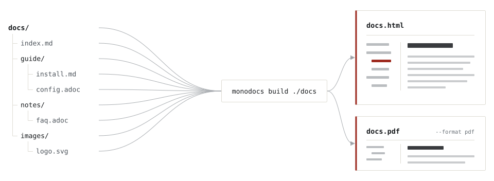

# &nbsp;monodocs

[](https://www.npmjs.com/package/monodocs)
[](https://github.com/kuttsun/monodocs/actions/workflows/release.yml)
[](#インストール)
[](https://www.npmjs.com/package/monodocs)
[](LICENSE)

[English](README.md)

複数の Markdown / AsciiDoc ファイルから **自己完結した単一の HTML または PDF** を生成する CLI です。書くときは複数ファイル、配るときは 1 ファイルにできます。

**📖 ドキュメント → [kuttsun.github.io/monodocs](https://kuttsun.github.io/monodocs/ja/)** — はじめに・コマンドオプション・設定リファレンス。[単一ファイルのサンプル](https://kuttsun.github.io/monodocs/ja/sample.html)もあります。

## 特徴

- **単一の自己完結ファイル** — 複数の Markdown / AsciiDoc（混在可）を 1 つの HTML にまとめ、画像は data URI として埋め込む。
- **ナビゲーション自動生成** — フォルダ構造から折りたたみ可能なサイドバー目次を生成し、ファイル間リンク・AsciiDoc xref を単一 HTML 内のリンクに変換する。
- **ドキュメントサイト UX** — 全文検索・ページ内目次・前後ページナビ・ダークモードを内蔵。
- **リッチなコンテンツ** — Mermaid 図と shiki コードハイライト（ダークモードに追従）に対応。
- **PDF 出力** — しおり・ページ間リンク付きの PDF を Chromium 経由で生成。

<picture>
  <source media="(prefers-color-scheme: dark)" srcset="docs/assets/bundle-dark.svg">
  
</picture>

## PDF 出力

PDF には表紙と印刷用の目次を付けられ、本文の各ページには既定でフッターにページ番号が入ります。数式はビルド時に描画されます。

<p>
  
  
  
</p>

> [!NOTE]
> 表紙と目次は既定では付きません。`monodocs.config.yml` の `pdf.cover.enabled` と `pdf.toc.enabled` で有効にします。
> 上の見本は [`site/samples/readme`](site/samples/readme) から生成しています。

## インストール

`monodocs` は **npm パッケージ**として配布し、Node.js 22.12.0 以上で動作します。対応対象は Linux x64 と Windows x64 です。

```bash
npm install -g monodocs
```

> [!IMPORTANT]
> PDF 出力と Mermaid pre-render には、システムにインストールされた Chromium / Google Chrome が必要です（`monodocs` はダウンロードしません）。Linux / Windows では自動検出します（Windows では Chromium ベースの Microsoft Edge にもフォールバックします）。macOS など自動検出の無い環境や標準的でない場所では、`PUPPETEER_EXECUTABLE_PATH` を設定してください。

Node.js 無しで動くスタンドアロンバイナリを、Linux x64 / Windows x64 向けに各[リリース](https://github.com/kuttsun/monodocs/releases)へ添付しています。ヘッドレスブラウザをバンドルから外しているため、PDF 出力と Mermaid pre-render はバイナリでは利用できません。

| 項目                            | サポート範囲                                   |
| ------------------------------- | ---------------------------------------------- |
| 配布方法                        | npm（`npm install` / `npx`）、リリースバイナリ |
| Node.js                         | 22.12.0 以上（バイナリでは不要）               |
| HTML / validate / watch / serve | Linux x64、Windows x64                         |
| PDF / pre-render                | システムの Chromium が必要。npm パッケージのみ |

## クイックスタート

Markdown / AsciiDoc を混在でき、フォルダ構造がそのままサイドバーになります。

```bash
monodocs init                                         # 手を入れずにビルドできる設定と最初のページ
monodocs build ./docs -o ./dist/doc.html              # 自己完結した単一 HTML
monodocs build ./docs --format pdf -o ./dist/doc.pdf  # PDF（要 Chromium）
monodocs serve ./docs                                 # 編集しながらライブプレビュー
monodocs validate ./docs                              # リンク切れ・画像欠落を検出
```

コマンド・オプションと `monodocs.config.yml` のリファレンスは[ドキュメントサイト](https://kuttsun.github.io/monodocs/ja/docs/getting-started)にあります。

## プロジェクトドキュメント

開発方針・技術スタック・ロードマップ・実装状況・テストは [docs/](docs/) にまとめています。

| ドキュメント                                       | 内容                                           |
| -------------------------------------------------- | ---------------------------------------------- |
| [docs/ja/development.md](docs/ja/development.md)   | 開発方針・開発環境・ディレクトリ構成・設計     |
| [docs/ja/architecture.md](docs/ja/architecture.md) | アーキテクチャ・実装不変条件・セキュリティ境界 |
| [docs/ja/tech-stack.md](docs/ja/tech-stack.md)     | 技術スタックとバージョン方針                   |
| [docs/ja/roadmap.md](docs/ja/roadmap.md)           | 仕様・ロードマップ                             |
| [docs/ja/syntax.md](docs/ja/syntax.md)             | 対応記法と制限（Markdown / AsciiDoc）          |
| [docs/ja/status.md](docs/ja/status.md)             | 実装状況                                       |
| [docs/ja/testing.md](docs/ja/testing.md)           | テスト方針・テスト結果                         |

アプリ本体のソースは [app/](app/) にあります。

コントリビューションの手順は [CONTRIBUTING.ja.md](CONTRIBUTING.ja.md)、脆弱性を非公開で報告する方法は
[SECURITY.ja.md](SECURITY.ja.md) を参照してください。

## ライセンス

[MIT License](LICENSE) © 2026 kuttsun

> [!NOTE]
> npm 公開物の `dist/monodocs.cjs` は依存ライブラリをバンドルするため、第三者ライセンスをまとめた
> `dist/THIRD-PARTY-NOTICES.txt`（`pnpm bundle` で生成）を添付します。埋め込む依存の大半は寛容ライセンス
> （MIT / ISC / BSD / Apache-2.0 等）で、`dompurify` は `MPL-2.0 OR Apache-2.0` のうち Apache-2.0 を選択しています。
> 埋め込む Mermaid ランタイムは、ほかに `elkjs`（EPL-2.0。EMF の一部は EPL-1.0）、CC BY-SA の断片、
> ライセンスを示していない出典のコードを含みます。inline ランタイムでビルドした HTML はそれらを表記とともに
> 埋め込みますが、文書の内容は影響を受けません。詳しくは[ライセンスのページ](https://kuttsun.github.io/monodocs/ja/docs/license)を参照してください。
