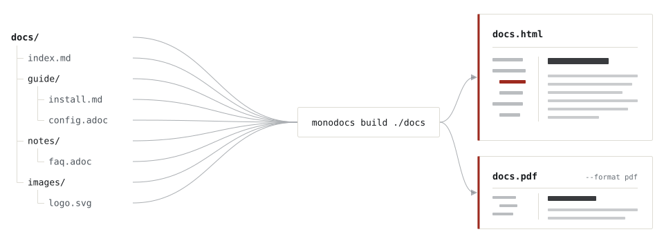

# monodocs

[日本語](README.ja.md)

`monodocs` is a **lightweight documentation generator focused on single-file distribution**. It is a CLI tool that turns a directory of Markdown and AsciiDoc files into a **single HTML or PDF document** — keep your documentation as multiple source files, and distribute it as one self-contained file.

**📖 Full documentation → [kuttsun.github.io/monodocs](https://kuttsun.github.io/monodocs/)** — getting started, command options, and the configuration reference. Try the [single-file sample](https://kuttsun.github.io/monodocs/sample.html).

## Features

- **Single self-contained file** — combines multiple Markdown and AsciiDoc files (freely mixed) into one HTML, with images embedded as data URIs.
- **Automatic navigation** — generates a collapsible sidebar from the directory structure and rewrites cross-file links and AsciiDoc xrefs into in-page routes.
- **Built-in reading experience** — full-text search, an in-page table of contents, previous/next navigation, and dark mode.
- **Rich content** — Mermaid diagrams and Shiki syntax highlighting that follow the selected color scheme.
- **PDF output** — produces a PDF with bookmarks and inter-page links through Chromium.

<picture>
  <source media="(prefers-color-scheme: dark)" srcset="docs/assets/bundle-dark.svg">
  
</picture>

## Installation

`monodocs` is distributed as an npm package for Node.js 22.12.0 or later. Linux x64 and Windows x64 are the supported platforms.

```bash
npm install -g monodocs
```

PDF output and Mermaid pre-rendering require a system-installed Chromium or Google Chrome; `monodocs` does not download a browser automatically. On Linux and Windows it is discovered automatically (Windows also falls back to Chromium-based Microsoft Edge). Set `PUPPETEER_EXECUTABLE_PATH` to point at the browser when it is installed in a non-standard location, or on platforms without built-in detection such as macOS.

A standalone binary that runs without Node.js is attached to every [release](https://github.com/kuttsun/monodocs/releases) for Linux x64 and Windows x64. It cannot produce PDFs or pre-render Mermaid, because both drive a headless browser that is deliberately left out of the bundle.

| Item                            | Support                                     |
| ------------------------------- | ------------------------------------------- |
| Distribution                    | npm (`npm install` / `npx`), release binary |
| Node.js                         | 22.12.0 or later (not needed by the binary) |
| HTML / validate / watch / serve | Linux x64, Windows x64                      |
| PDF / pre-render                | Requires system Chromium; npm package only  |

## Quick start

Markdown and AsciiDoc files may be mixed; the input directory structure becomes the sidebar.

```bash
monodocs build ./docs -o ./dist/doc.html              # single self-contained HTML
monodocs build ./docs --format pdf -o ./dist/doc.pdf  # PDF (requires Chromium)
monodocs serve ./docs                                 # live preview while editing
monodocs validate ./docs                              # report broken links / missing images
```

For every command and option, and the reference for the `monodocs.config.yml` configuration file, see the [documentation site](https://kuttsun.github.io/monodocs/docs/getting-started).

## Project documentation

| Document                  | English                         | 日本語                            |
| ------------------------- | ------------------------------- | --------------------------------- |
| Development guide         | [English](docs/development.md)  | [日本語](docs/ja/development.md)  |
| Architecture              | [English](docs/architecture.md) | [日本語](docs/ja/architecture.md) |
| Technology stack          | [English](docs/tech-stack.md)   | [日本語](docs/ja/tech-stack.md)   |
| Roadmap and specification | [English](docs/roadmap.md)      | [日本語](docs/ja/roadmap.md)      |
| Supported syntax          | [English](docs/syntax.md)       | [日本語](docs/ja/syntax.md)       |
| Implementation status     | [English](docs/status.md)       | [日本語](docs/ja/status.md)       |
| Testing                   | [English](docs/testing.md)      | [日本語](docs/ja/testing.md)      |

See [CONTRIBUTING.md](CONTRIBUTING.md) before contributing and [SECURITY.md](SECURITY.md) to report a vulnerability privately.

## License

[MIT License](LICENSE) © 2026 kuttsun

The npm bundle includes `dist/THIRD-PARTY-NOTICES.txt`, generated during `pnpm bundle`, for bundled third-party dependencies.
