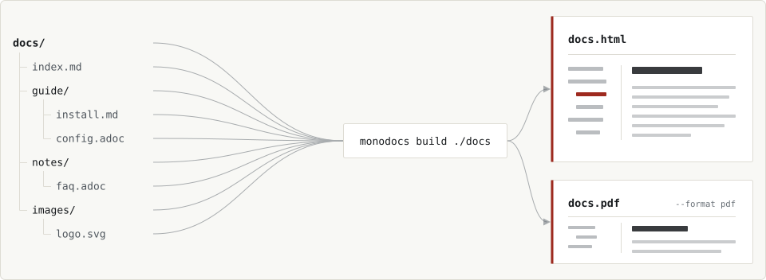
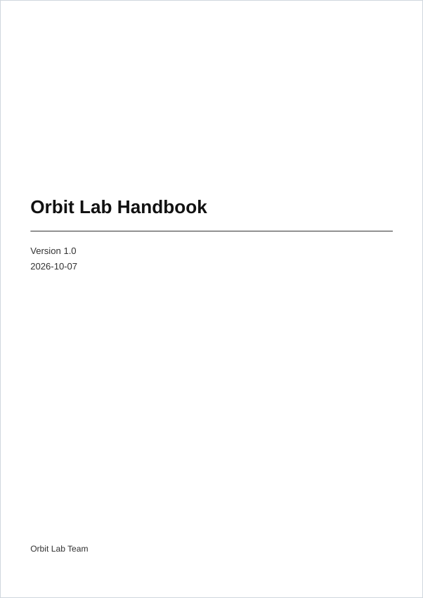
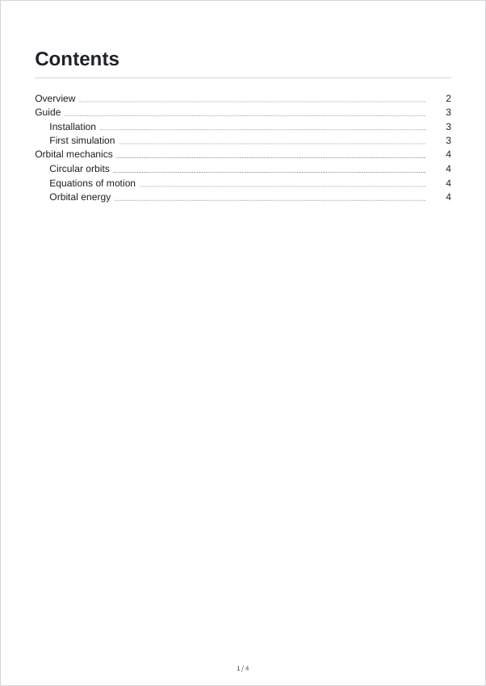
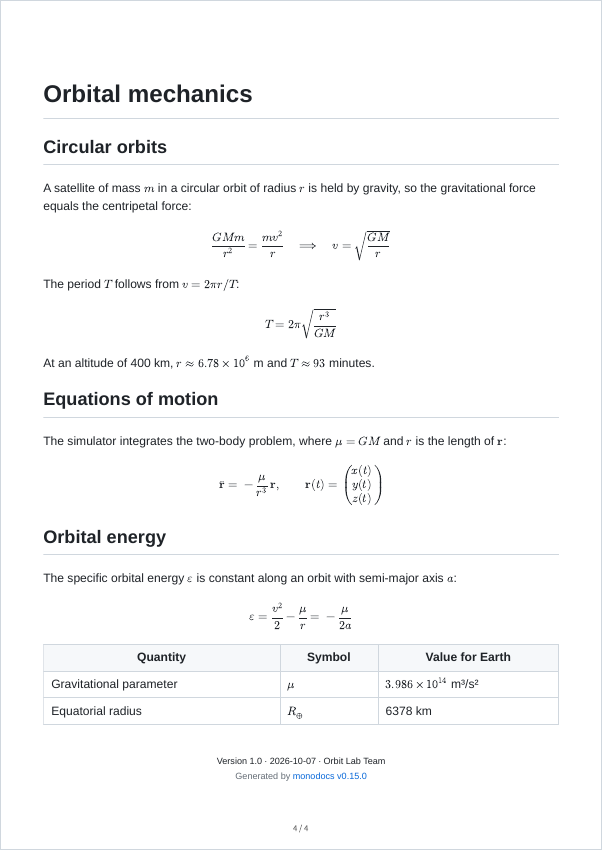

# &nbsp;monodocs

[](https://www.npmjs.com/package/monodocs)
[](https://github.com/kuttsun/monodocs/actions/workflows/release.yml)
[](#installation)
[](https://www.npmjs.com/package/monodocs)
[](LICENSE)

[日本語](README.ja.md)

`monodocs` is a CLI that turns a directory of Markdown and AsciiDoc files into a **single self-contained HTML or PDF document**: write in many files, distribute one.

**📖 Full documentation → [kuttsun.github.io/monodocs](https://kuttsun.github.io/monodocs/)** — getting started, command options, and the configuration reference. Try the [single-file sample](https://kuttsun.github.io/monodocs/sample.html).

## Features

- **Single self-contained file** — combines multiple Markdown and AsciiDoc files (freely mixed) into one HTML, with images embedded as data URIs.
- **Automatic navigation** — generates a collapsible sidebar from the directory structure and rewrites cross-file links and AsciiDoc xrefs into in-page routes.
- **Built-in reading experience** — full-text search, an in-page table of contents, previous/next navigation, and dark mode.
- **Rich content** — Mermaid diagrams and Shiki syntax highlighting that follow the selected color scheme.
- **PDF output** — produces a PDF with bookmarks and inter-page links through Chromium.



## PDF output

A PDF can open with a cover and a printed table of contents, and the body pages carry a page-number
footer by default. Formulas are rendered at build time.

<p>
  
  
  
</p>

> [!NOTE]
> The cover and the table of contents are off by default. Turn them on with `pdf.cover.enabled` and
> `pdf.toc.enabled` in `monodocs.config.yml`. The pages above come from
> [`site/samples/readme`](site/samples/readme).

## Installation

`monodocs` is distributed as an npm package for Node.js 22.12.0 or later. Linux x64 and Windows x64 are the supported platforms.

```bash
npm install -g monodocs
```

> [!IMPORTANT]
> PDF output and Mermaid pre-rendering need a system-installed Chromium or Google Chrome; `monodocs` never downloads one. It is found automatically on Linux and Windows (Windows also falls back to Chromium-based Microsoft Edge). Elsewhere, such as macOS, or for a non-standard location, set `PUPPETEER_EXECUTABLE_PATH`.

A standalone binary that runs without Node.js is attached to every [release](https://github.com/kuttsun/monodocs/releases) for Linux x64 and Windows x64. It cannot produce PDFs or pre-render Mermaid, because both drive a headless browser that is left out of the bundle.

| Item                            | Support                                     |
| ------------------------------- | ------------------------------------------- |
| Distribution                    | npm (`npm install` / `npx`), release binary |
| Node.js                         | 22.12.0 or later (not needed by the binary) |
| HTML / validate / watch / serve | Linux x64, Windows x64                      |
| PDF / pre-render                | Requires system Chromium; npm package only  |

## Quick start

Markdown and AsciiDoc may be mixed; the directory structure becomes the sidebar.

```bash
monodocs init                                         # a config and a first page that build unedited
monodocs build ./docs -o ./dist/doc.html              # single self-contained HTML
monodocs build ./docs --format pdf -o ./dist/doc.pdf  # PDF (requires Chromium)
monodocs serve ./docs                                 # live preview while editing
monodocs validate ./docs                              # report broken links / missing images
```

Commands, options, and the `monodocs.config.yml` reference are on the [documentation site](https://kuttsun.github.io/monodocs/docs/getting-started).

## Project documentation

| Document                  | English                         | 日本語                            |
| ------------------------- | ------------------------------- | --------------------------------- |
| Development guide         | [English](docs/development.md)  | [日本語](docs/ja/development.md)  |
| Architecture              | [English](docs/architecture.md) | [日本語](docs/ja/architecture.md) |
| Technology stack          | [English](docs/tech-stack.md)   | [日本語](docs/ja/tech-stack.md)   |
| Roadmap and specification | [English](docs/roadmap.md)      | [日本語](docs/ja/roadmap.md)      |
| Supported syntax          | [English](docs/syntax.md)       | [日本語](docs/ja/syntax.md)       |
| Implementation status     | [English](docs/status.md)       | [日本語](docs/ja/status.md)       |
| Testing                   | [English](docs/testing.md)      | [日本語](docs/ja/testing.md)      |

See [CONTRIBUTING.md](CONTRIBUTING.md) before contributing and [SECURITY.md](SECURITY.md) to report a vulnerability privately.

## License

[MIT License](LICENSE) © 2026 kuttsun

> [!NOTE]
> The npm bundle includes `dist/THIRD-PARTY-NOTICES.txt` (generated by `pnpm bundle`) for its third-party
> dependencies. The embedded Mermaid runtime contains `elkjs` under the EPL-2.0 (with parts of EMF under the
> EPL-1.0), a few CC BY-SA snippets, and a few pieces of code whose source states no license. HTML built with
> the inline runtime embeds them with their notices; your document content is unaffected. See the
> [license page](https://kuttsun.github.io/monodocs/docs/license).
