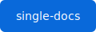

= リンクと画像
:sd-order: 5
:url-repo: https://example.com/single-docs

== リンク

* URL マクロ: {url-repo}[single-docs リポジトリ]
* そのまま: https://docs.asciidoctor.org/
* メール: mailto:docs@example.com[ドキュメント担当]
* 別ファイルへの相互参照（xref）: xref:index.adoc[トップに戻る] /
  xref:blocks.adoc[ブロックのページ]

== 属性（attribute）

ヘッダーで定義した属性 `{url-repo}` を本文で展開できます: {url-repo}

== 内部アンカーと相互参照

[#install-section]
=== インストール手順（アンカー付き）

この見出しには `[#install-section]` でアンカー（ID）を付けています。

別の場所から <<install-section,インストール手順へ>> のように参照できます。
クリックするとページを切り替えずに該当箇所へスクロールします。

== 画像

ブロック画像（キャプション付き）:

.single-docs ロゴ

インライン画像  を文中に置くこともできます。

== UI マクロ

* キー入力: kbd:[Ctrl+S] で保存、kbd:[Ctrl+Shift+P]
* ボタン: btn:[OK] をクリック
* メニュー: menu:File[New > Project] を選択

== 脚注

本文に脚注を付けられますfootnote:[これは脚注です。単一 HTML 内で一意な ID になります。]。
名前付き脚注footnote:ref1[再利用できる脚注。]も使え、同じものを再度参照できますfootnote:ref1[]。
