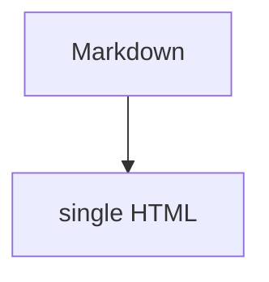

# 使い方

## 基本

```bash
single-docs build ./docs -o ./dist/manual.html
```

生成された `manual.html` をブラウザで開くと、左サイドバーから
各ページを切り替えられます（hash route による疑似ページ切り替え）。

## 図表（Mermaid は v0.3 で対応予定）

現状では下記はコードブロックとして表示されます。


