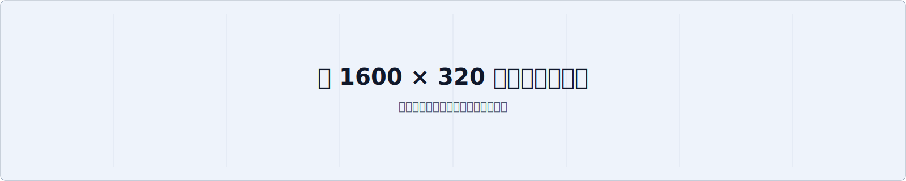

= 幅の広いコンテンツ
:sd-order: 6

本文は読みやすい幅（既定で最大 860px）に保たれます。それより幅の広い表・リスティング・画像が
AsciiDoc でどう表示されるかを確認するサンプルです。ブラウザ幅を変えても本文幅は一定で、
本文幅に収まらない要素はその要素の中で横スクロールし、画像は本文幅に合わせて縮小表示されます。

== 幅の広い表

列数の多い表は本文幅に収まらないため、表の中で横スクロールして残りの列を見られます。

[cols="1,>1,>1,>1,>1,>1,>1,>1,>1,>1,>1,>1,>1", options="header"]
|===
| 指標 | 1月 | 2月 | 3月 | 4月 | 5月 | 6月 | 7月 | 8月 | 9月 | 10月 | 11月 | 12月

| ページビュー | 1200 | 1840 | 2010 | 1750 | 2230 | 2680 | 3120 | 2990 | 2640 | 2880 | 3310 | 3720
| ユニーク | 820 | 1190 | 1320 | 1180 | 1460 | 1710 | 1980 | 1920 | 1700 | 1840 | 2100 | 2350
| 直帰率(%) | 58 | 55 | 53 | 54 | 51 | 49 | 47 | 48 | 50 | 49 | 46 | 44
|===

== 行の長いリスティング

長い行を含むリスティングブロックは、ブロックの中で横スクロールします。短いコードはそのまま表示されます。

[source,bash]
----
docker run --rm -it --name monodocs-dev -v "$(pwd)":/work -w /work/app -e NODE_ENV=development -p 4173:4173 monodocs-dev node packages/cli/dist/index.js serve examples/docs --host 0.0.0.0 --port 4173
----

[source,js]
----
const width = 860;
----

== 大きな画像

intrinsic 幅が本文幅より大きい画像は、本文幅に合わせて縮小表示されます。

