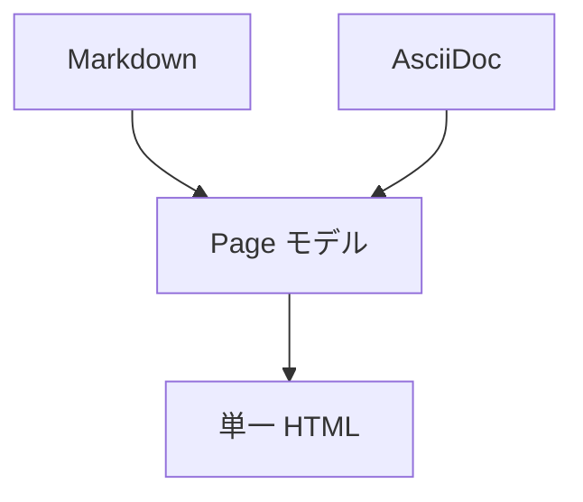

# コードブロックと表

## フェンスドコードブロック

言語を指定すると shiki で構文ハイライトされます。

```js
// JavaScript
function greet(name) {
  return `Hello, ${name}!`;
}
console.log(greet("single-docs"));
```

```python
# Python
def fib(n):
    a, b = 0, 1
    for _ in range(n):
        a, b = b, a + b
    return a
```

```bash
single-docs build ./docs -o ./dist/manual.html
```

```json
{ "title": "社内ドキュメント", "output": { "format": "html" } }
```

チルダ（`~~~`）のフェンスも使えます。

~~~yaml
title: tilde fence
nested: true
~~~

## 言語指定なし / インデントコード

```
言語指定なしのコードブロック（ハイライトなし）
```

インデント（半角スペース 4 つ）でもコードブロックになります。

    indented code block
    second line

## 表（GFM 拡張）

| 機能           | Markdown | AsciiDoc |
| -------------- | :------: | -------: |
| 見出し         |    ✅    |       ✅ |
| 表             |    ✅    |       ✅ |
| 脚注           |    ✅    |       ✅ |
| コードハイライト |   shiki  |    shiki |

- 左寄せ `:---` / 中央 `:---:` / 右寄せ `---:`
- セル内で `**強調**` や `` `code` `` も使えます。

## Mermaid


