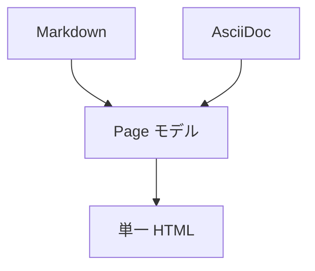

# コードブロックと表

各項目は **ソース** を先に示し、その下に **表示（HTML 変換結果）** を並べます。

## フェンスドコードブロック

言語を指定すると shiki で構文ハイライトされます。

**ソース:**

````markdown
```js
// JavaScript
function greet(name) {
  return `Hello, ${name}!`;
}
console.log(greet("single-docs"));
```
````

**表示:**

```js
// JavaScript
function greet(name) {
  return `Hello, ${name}!`;
}
console.log(greet("single-docs"));
```

チルダ（`~~~`）のフェンスも使えます。

**ソース:**

````markdown
~~~yaml
title: tilde fence
nested: true
~~~
````

**表示:**

~~~yaml
title: tilde fence
nested: true
~~~

## 言語指定なし / インデントコード

言語指定の無いフェンス、または半角スペース 4 つのインデントでもコードブロックになります（ハイライトなし）。

**ソース:**

````markdown
```
言語指定なしのコードブロック（ハイライトなし）
```

    indented code block
    second line
````

**表示:**

```
言語指定なしのコードブロック（ハイライトなし）
```

    indented code block
    second line

## 表（GFM 拡張）

`:---` で左寄せ、`:---:` で中央、`---:` で右寄せ。セル内で `**強調**` や `` `code` `` も使えます。

**ソース:**

```markdown
| 機能             | Markdown | AsciiDoc |
| ---------------- | :------: | -------: |
| 見出し           |    ✅    |       ✅ |
| 表               |    ✅    |       ✅ |
| 脚注             |    ✅    |       ✅ |
| コードハイライト |  shiki   |    shiki |
```

**表示:**

| 機能             | Markdown | AsciiDoc |
| ---------------- | :------: | -------: |
| 見出し           |    ✅    |       ✅ |
| 表               |    ✅    |       ✅ |
| 脚注             |    ✅    |       ✅ |
| コードハイライト |  shiki   |    shiki |

## Mermaid

` ```mermaid ` フェンスは図として描画されます。

**ソース:**

````markdown

````

**表示:**


