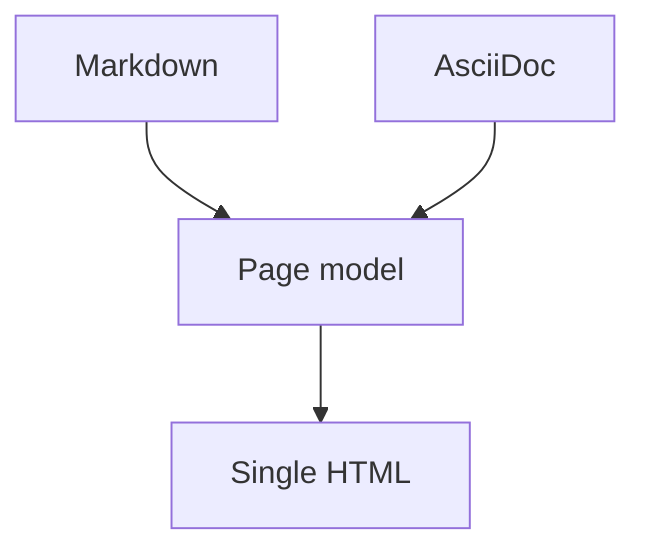

# Code blocks and tables

Each item shows the **source** first, then the **rendered output (HTML)** below it.

## Fenced code blocks

When you specify a language, it is syntax-highlighted by shiki.

**Source:**

````markdown
```js
// JavaScript
function greet(name) {
  return `Hello, ${name}!`;
}
console.log(greet("monodocs"));
```
````

**Rendered:**

```js
// JavaScript
function greet(name) {
  return `Hello, ${name}!`;
}
console.log(greet("monodocs"));
```

Tilde (`~~~`) fences work too.

**Source:**

````markdown
~~~yaml
title: tilde fence
nested: true
~~~
````

**Rendered:**

~~~yaml
title: tilde fence
nested: true
~~~

## No language / indented code

A fence with no language, or four leading spaces, also creates a code block (without highlighting).

**Source:**

````markdown
```
A code block with no language specified (no highlighting)
```

    indented code block
    second line
````

**Rendered:**

```
A code block with no language specified (no highlighting)
```

    indented code block
    second line

## Tables (GFM extension)

`:---` left-aligns, `:---:` centers, `---:` right-aligns. You can use `**emphasis**` and `` `code` `` inside cells.

**Source:**

```markdown
| Feature           | Markdown | AsciiDoc |
| ----------------- | :------: | -------: |
| Headings          |    ✅    |       ✅ |
| Tables            |    ✅    |       ✅ |
| Footnotes         |    ✅    |       ✅ |
| Code highlighting |  shiki   |    shiki |
```

**Rendered:**

| Feature           | Markdown | AsciiDoc |
| ----------------- | :------: | -------: |
| Headings          |    ✅    |       ✅ |
| Tables            |    ✅    |       ✅ |
| Footnotes         |    ✅    |       ✅ |
| Code highlighting |  shiki   |    shiki |

## Mermaid

A ` ```mermaid ` fence is rendered as a diagram.

**Source:**

````markdown

````

**Rendered:**


