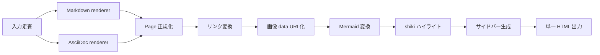

# 幅の広いコンテンツ

本文は読みやすい幅（既定で最大 860px）に保たれます。設定ファイルの
`html.contentWidth` で固定幅を変えたり、`full` で横幅いっぱいまで広げたりできます。
それより幅の広い表・コードブロック・画像・図がどう表示されるかを確認するサンプルです。

> [!NOTE]
> 既定テーマでは本文の幅は `html.contentWidth` で調整できます。本文幅に収まらない表やコードは、
> **その要素の中で横スクロール**して全体を閲覧できます。画像や図は**本文幅に合わせて縮小表示**
> されます（ページ全体には横スクロールが出ません）。

## 幅の広い表

列数の多い表は本文幅に収まりません。表全体がスクロール領域になり、**表の上で横スクロール**して
残りの列を見られます。

| 指標         |  1月 |  2月 |  3月 |  4月 |  5月 |  6月 |  7月 |  8月 |  9月 | 10月 | 11月 | 12月 |
| ------------ | ---: | ---: | ---: | ---: | ---: | ---: | ---: | ---: | ---: | ---: | ---: | ---: |
| ページビュー | 1200 | 1840 | 2010 | 1750 | 2230 | 2680 | 3120 | 2990 | 2640 | 2880 | 3310 | 3720 |
| ユニーク     |  820 | 1190 | 1320 | 1180 | 1460 | 1710 | 1980 | 1920 | 1700 | 1840 | 2100 | 2350 |
| 直帰率(%)    |   58 |   55 |   53 |   54 |   51 |   49 |   47 |   48 |   50 |   49 |   46 |   44 |

## 行の長いコードブロック

長い行を含むコードは、**コードブロックの中で横スクロール**します。短いコードはそのまま表示されます。

**長い行:**

```bash
docker run --rm -it --name monodocs-dev -v "$(pwd)":/work -w /work/app -e NODE_ENV=development -p 4173:4173 monodocs-dev node packages/cli/dist/index.js serve examples/ja --host 0.0.0.0 --port 4173
```

**短い行:**

```js
const width = 860;
```

## 大きな画像

intrinsic 幅が本文幅より大きい画像は、**本文幅に合わせて縮小表示**されます（`max-width: 100%`）。


## Mermaid（横長の図）

横に長いフロー図も、本文幅に合わせて表示されます。


