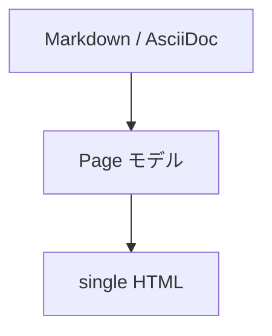

# 使い方

Markdown で書かれた使い方ページです。

```bash
single-docs build ./docs -o ./dist/manual.html
```

生成された単一 HTML をブラウザで開くと、Markdown / AsciiDoc 両方のページを
サイドバーから切り替えられます。

## 処理の流れ


```mermaid
graph TD
  A[Markdown / AsciiDoc] --> B[Page モデル]
  B --> C[single HTML]
```
