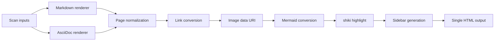

# Wide content

The body is kept at a comfortable reading width (max 860px by default). You can change the
fixed width with `html.contentWidth` in the config file, or set it to `full` to span the full width.
Set `html.contentWidthToggle` to `false` when readers should not be able to change that width.
Set `html.contentWidthDefault` to `wide` to start in wide mode until the reader makes a choice.
This sample shows how tables, code blocks, images, and diagrams wider than that are displayed.

> [!NOTE]
> In the default theme, the body width can be adjusted with `html.contentWidth`. Tables and code that
> don't fit the body width can be **scrolled horizontally within that element** to view the whole thing.
> Images and diagrams are **scaled down to fit the body width** (no horizontal scrollbar appears for the
> whole page).

## A wide table

A table with many columns won't fit the body width. The whole table becomes a scroll area, and you can
**scroll horizontally over the table** to see the remaining columns.

| Metric     |  Jan |  Feb |  Mar |  Apr |  May |  Jun |  Jul |  Aug |  Sep |  Oct |  Nov |  Dec |
| ---------- | ---: | ---: | ---: | ---: | ---: | ---: | ---: | ---: | ---: | ---: | ---: | ---: |
| Page views | 1200 | 1840 | 2010 | 1750 | 2230 | 2680 | 3120 | 2990 | 2640 | 2880 | 3310 | 3720 |
| Unique     |  820 | 1190 | 1320 | 1180 | 1460 | 1710 | 1980 | 1920 | 1700 | 1840 | 2100 | 2350 |
| Bounce (%) |   58 |   55 |   53 |   54 |   51 |   49 |   47 |   48 |   50 |   49 |   46 |   44 |

## A code block with long lines

Code containing long lines **scrolls horizontally within the code block**. Short code is shown as-is.

**Long line:**

```bash
docker run --rm -it --name monodocs-dev -v "$(pwd)":/work -w /work/app -e NODE_ENV=development -p 4173:4173 monodocs-dev node packages/cli/dist/index.js serve ../examples/en --host 0.0.0.0 --port 4173
```

**Short line:**

```js
const width = 860;
```

## A large image

An image whose intrinsic width is larger than the body width is **scaled down to fit the body width** (`max-width: 100%`).


## Mermaid (a wide diagram)

A horizontally long flow diagram is also displayed to fit the body width.


