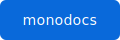

= リンクと画像
:sd-order: 104
:url-repo: https://example.com/monodocs

各項目は *ソース* を先に示し、その下に *表示（HTML 変換結果）* を並べます。

== リンク

URL マクロ・メール・別ファイルへの相互参照（xref）です。

*ソース:*

[source,asciidoc]
------
* URL マクロ: {url-repo}[monodocs リポジトリ]
* そのまま: https://docs.asciidoctor.org/
* メール: mailto:docs@example.com[ドキュメント担当]
* 別ファイルへの相互参照（xref）: xref:index.adoc[トップに戻る] /
  xref:blocks.adoc[ブロックのページ]
------

*表示:*

* URL マクロ: {url-repo}[monodocs リポジトリ]
* そのまま: https://docs.asciidoctor.org/
* メール: mailto:docs@example.com[ドキュメント担当]
* 別ファイルへの相互参照（xref）: xref:index.adoc[トップに戻る] /
  xref:blocks.adoc[ブロックのページ]

== 属性（attribute）

ヘッダーで定義した属性 `{url-repo}` を本文で展開できます。

*ソース:*

[source,asciidoc]
------
ヘッダーで定義した属性 `{url-repo}` を本文で展開できます: {url-repo}
------

*表示:*

ヘッダーで定義した属性 `{url-repo}` を本文で展開できます: {url-repo}

== 内部アンカーと相互参照

`[#id]` で見出しにアンカーを付け、`<<id,テキスト>>` で参照します。クリックするとページを切り替えずに該当箇所へスクロールします。

*ソース:*

[source,asciidoc]
------
[#install-section]
=== インストール手順（アンカー付き）

この見出しには `[#install-section]` でアンカー（ID）を付けています。
別の場所から <<install-section,インストール手順へ>> のように参照できます。
------

*表示:*

[#install-section]
=== インストール手順（アンカー付き）

この見出しには `[#install-section]` でアンカー（ID）を付けています。
別の場所から <<install-section,インストール手順へ>> のように参照できます。

== 画像

`image::` はブロック画像（キャプション付き）、`image:` はインライン画像です（画像は単一 HTML に data URI で埋め込まれます）。

*ソース:*

[source,asciidoc]
------
.monodocs ロゴ

インライン画像  を文中に置くこともできます。
------

*表示:*

.monodocs ロゴ

インライン画像  を文中に置くこともできます。

== UI マクロ

キー入力・ボタン・メニューを表すマクロです。

*ソース:*

[source,asciidoc]
------
* キー入力: kbd:[Ctrl+S] で保存、kbd:[Ctrl+Shift+P]
* ボタン: btn:[OK] をクリック
* メニュー: menu:File[New > Project] を選択
------

*表示:*

* キー入力: kbd:[Ctrl+S] で保存、kbd:[Ctrl+Shift+P]
* ボタン: btn:[OK] をクリック
* メニュー: menu:File[New > Project] を選択

== 脚注

`footnote:[...]` で脚注、`footnote:ref1[...]` で再利用できる名前付き脚注になります。

*ソース:*

[source,asciidoc]
------
本文に脚注を付けられますfootnote:[これは脚注です。単一 HTML 内で一意な ID になります。]。
名前付き脚注footnote:ref1[再利用できる脚注。]も使え、同じものを再度参照できますfootnote:ref1[]。
------

*表示:*

本文に脚注を付けられますfootnote:[これは脚注です。単一 HTML 内で一意な ID になります。]。
名前付き脚注footnote:ref1[再利用できる脚注。]も使え、同じものを再度参照できますfootnote:ref1[]。
